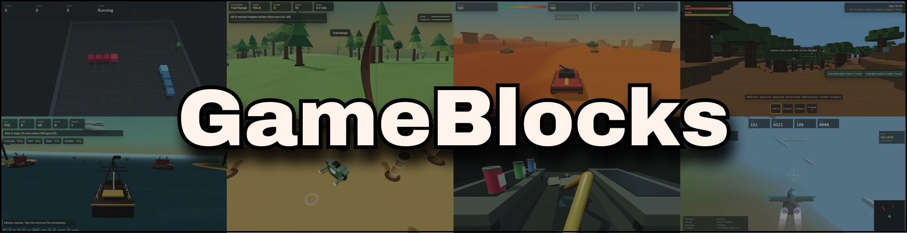

## 📖 Introduction

### What Is GameBlocks

GameBlocks helps coding agents build browser-based 3D game prototypes.

GameBlocks provides **building-block code**: concise and self-explanatory modules designed for agents to compose, adapt, and generalize from while implementing fragile 3D game systems such as coordinate frames, actor motion, and world structure.

### Why GameBlocks

Natural language is a weak interface for precise 3D behavior. Prompts and agent reasoning must compress spatial transformations into language tokens. Small ambiguities can cause inverted directions, unstable motion, or gameplay state that no longer matches what appears on screen.

GameBlocks reduces that difficulty by turning fragile 3D and gameplay patterns into inspectable implementations with clear semantics. Instead of deriving 3D behavior from scratch, agents can generalize from GameBlocks to build spatially accurate 3D games.

### For Stateful Generative Worlds

GameBlocks focuses on the stateful layer of a world rather than visual aesthetics. The vision is that [world-rendering models](https://www.worldlabs.ai/blog/taxonomy-of-world-models) will increasingly lift the burden of visual generation.

In that future, GameBlocks provides the structured interactive state that those models can render from, update, and keep consistent as agents and players act inside the world.

References: [Moonlake](https://moonlakeai.com/blog/why-world-models-need-structure-not-just-scale), [Game Cartridges](https://x.com/AlbyHojel/status/2057193508822536459), [Project Eden](https://www.tripo3d.ai/research/project-eden).


## 🤖 Use in Agents

GameBlocks can be used as a local skill so a coding agent can discover it when a task involves browser-based 3D game development.

### Codex

1. Clone the repository locally.

2. Run this command from the repository root (to copy `gameblocks` to the skills folder):
```bash
mkdir -p ~/.codex/skills/gameblocks && cp -R gameblocks/. ~/.codex/skills/gameblocks/
```
3. Restart the Codex app (optional).

4. In the Codex chatbox, invoke the skill by typing `/gameblocks` or `$gameblocks`, or let it load automatically when the task matches the skill description.

### Claude Code

1. Clone the repository locally.

2. Run this command from the repository root (to copy `gameblocks` to the skills folder):
```bash
mkdir -p ~/.claude/skills/gameblocks && cp -R gameblocks/. ~/.claude/skills/gameblocks/
```
3. Restart the Claude app (optional).

4. In the Claude Code chatbox, invoke the skill by typing `/gameblocks`, or let it load automatically when the task matches the skill description.

## 🎬 Demo

### Playable Games

| Preview | Title | Description | Link |
| --- | --- | --- | --- |
| <a href="https://gb-archery-hunting.vercel.app/">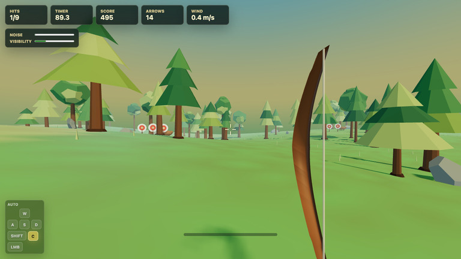</a> | **Archery Hunting** | Hit marked targets with limited time and ammo under difficult conditions. | [https://gb-archery-hunting.vercel.app/](https://gb-archery-hunting.vercel.app/) |
| <a href="https://gb-jet-dogfight.vercel.app/">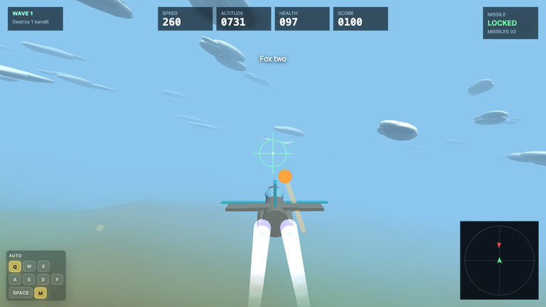</a> | **Jet Dogfight** | Battle waves of enemy aircraft using evasive flying, guns, and missiles. | [https://gb-jet-dogfight.vercel.app/](https://gb-jet-dogfight.vercel.app/) |
| <a href="https://gb-desert-shooter.vercel.app/">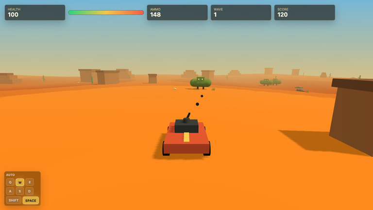</a> | **Desert Shooter** | Survive dinosaur waves, protect your rover, and destroy enemies for high scores. | [https://gb-desert-shooter.vercel.app/](https://gb-desert-shooter.vercel.app/) |
| <a href="https://gb-marble-puzzle.vercel.app/">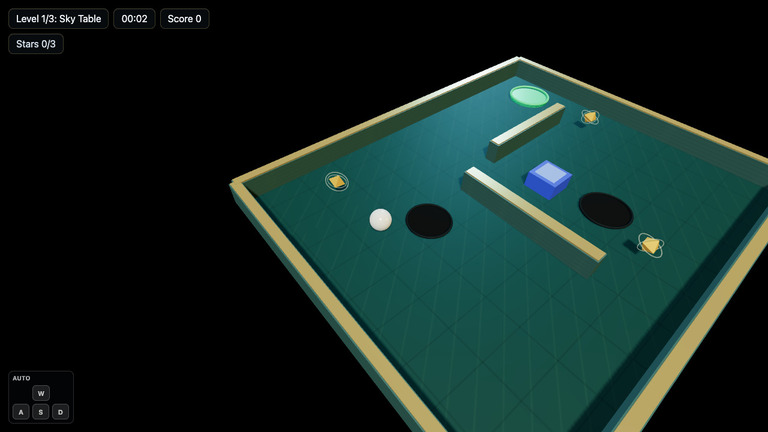</a> | **Marble Puzzle** | Tilt, collect stars, and guide the marble past hazards to the goal. | [https://gb-marble-puzzle.vercel.app/](https://gb-marble-puzzle.vercel.app/) |
| <a href="https://gb-pirate-seas.vercel.app/">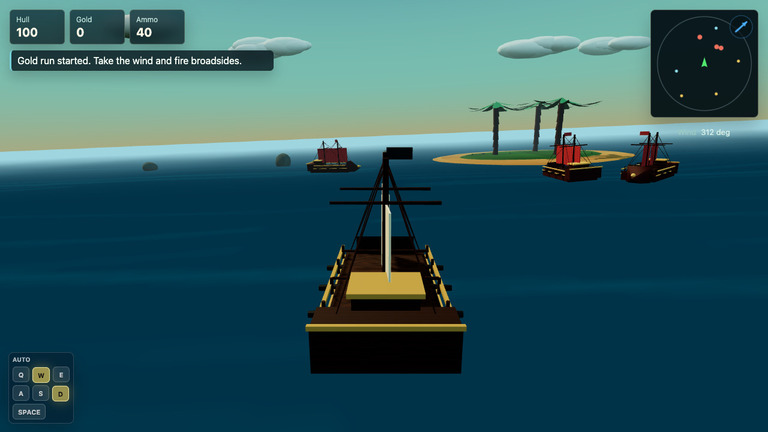</a> | **Pirate Seas** | Sail, sink enemy ships, collect gold, and survive as long as possible. | [https://gb-pirate-seas.vercel.app/](https://gb-pirate-seas.vercel.app/) |
| <a href="https://gb-snake-clash.vercel.app/">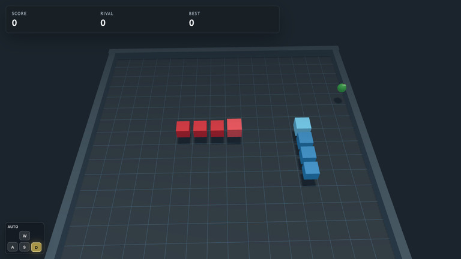</a> | **Snake Clash** | Collect apples and outscore your rival while avoiding walls and collisions. | [https://gb-snake-clash.vercel.app/](https://gb-snake-clash.vercel.app/) |
| <a href="https://gb-space-shooter.vercel.app/">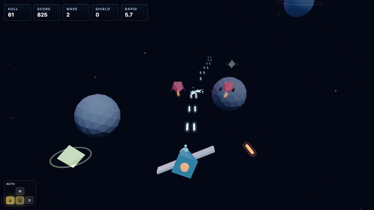</a> | **Space Shooter** | Fight enemy waves, break asteroids, collect upgrades, and protect your hull. | [https://gb-space-shooter.vercel.app/](https://gb-space-shooter.vercel.app/) |
| <a href="https://gb-submarine-exploration.vercel.app/">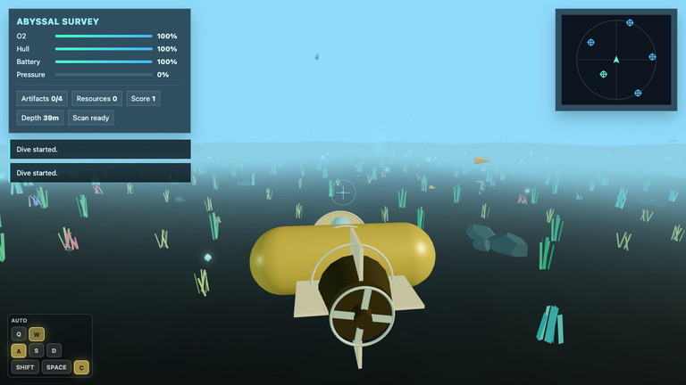</a> | **Submarine Exploration** | Gather artifacts and resources, avoid hazards, and return to the upgrade station. | [https://gb-submarine-exploration.vercel.app/](https://gb-submarine-exploration.vercel.app/) |
| <a href="https://gb-endless-runner.vercel.app/">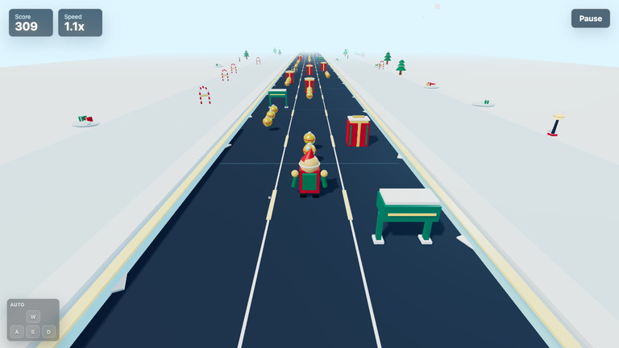</a> | **Endless Runner** | Run, collect coins and boosts, and dodge obstacles for the highest score. | [https://gb-endless-runner.vercel.app/](https://gb-endless-runner.vercel.app/) |
| <a href="https://gb-voxel-survival.vercel.app/">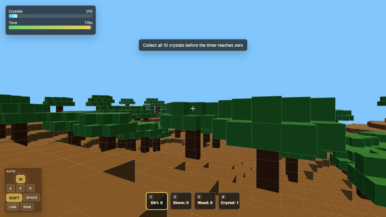</a> | **Voxel Survival** | Explore the voxel world and collect all crystals before time runs out. | [https://gb-voxel-survival.vercel.app/](https://gb-voxel-survival.vercel.app/) |
| <a href="https://gb-robotic-arm.vercel.app/">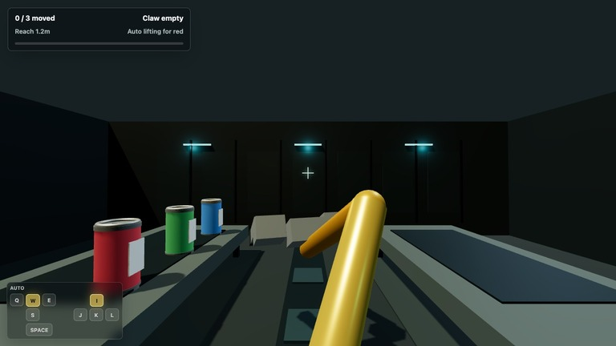</a> | **Robotic Arm** | Control a robotic claw to move cargo onto the receiving table. | [https://gb-robotic-arm.vercel.app/](https://gb-robotic-arm.vercel.app/) |
| <a href="https://gb-castle-defense.vercel.app/">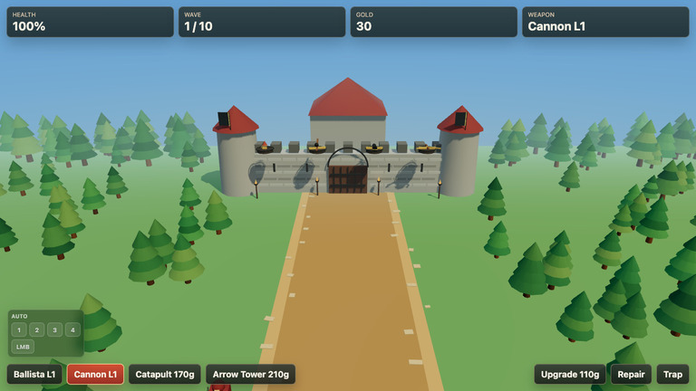</a> | **Castle Defense** | Defend the castle through ten waves using weapons, repairs, upgrades, and traps. | [https://gb-castle-defense.vercel.app/](https://gb-castle-defense.vercel.app/) |
| <a href="https://gb-tower-defense.vercel.app/">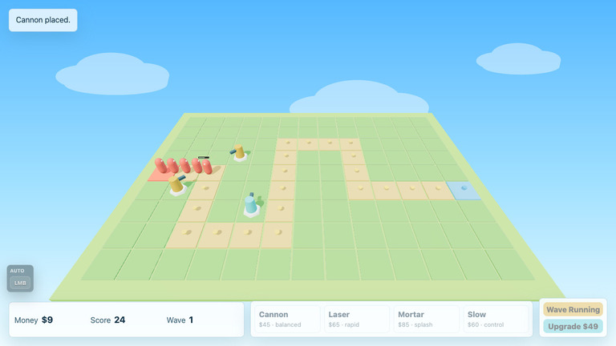</a> | **Tower Defense** | Build and upgrade towers to stop enemies before they breach the base. | [https://gb-tower-defense.vercel.app/](https://gb-tower-defense.vercel.app/) |
| <a href="https://gb-mech-arena.vercel.app/">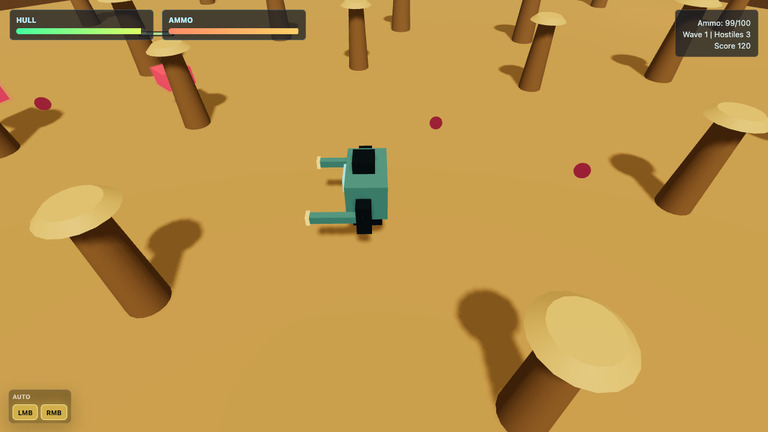</a> | **Mech Arena** | Fight enemy drone waves, survive incoming fire, and keep your mech online. | [https://gb-mech-arena.vercel.app/](https://gb-mech-arena.vercel.app/) |
| <a href="https://gb-drone-delivery.vercel.app/">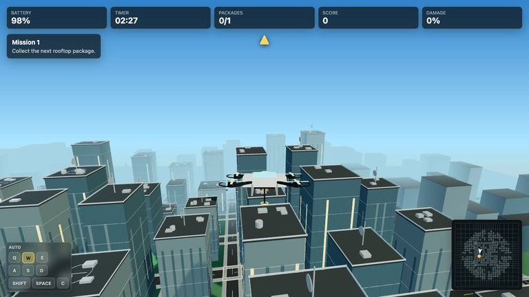</a> | **Drone Delivery** | Deliver rooftop packages before time or battery runs out without damaging buildings. | [https://gb-drone-delivery.vercel.app/](https://gb-drone-delivery.vercel.app/) |
| <a href="https://gb-moon-racing.vercel.app/">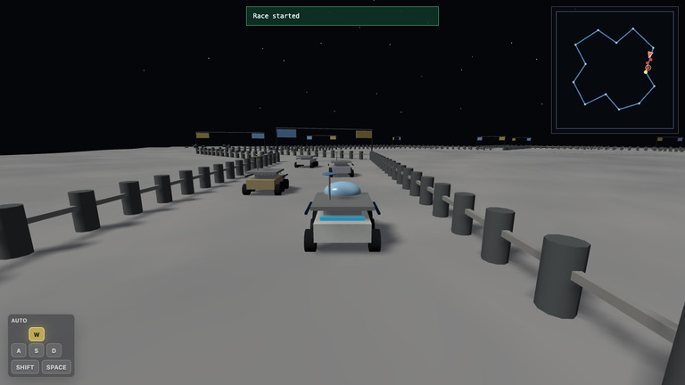</a> | **Moon Racing** | Complete lunar checkpoint laps and beat the rover field to the finish. | [https://gb-moon-racing.vercel.app/](https://gb-moon-racing.vercel.app/) |

### Gameplay Video

https://github.com/user-attachments/assets/98d22d80-06b6-49ac-8b33-2215ccb42222


## 📜 License

GameBlocks is released under the [MIT License](LICENSE).
